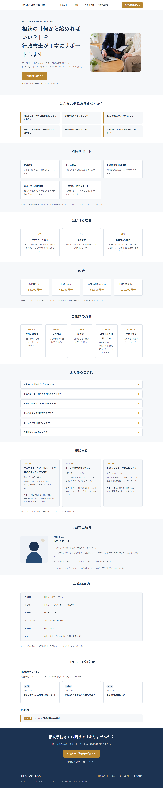

# 相続行政書士 Webサイト改善サンプル

相続を扱う行政書士向けに、
「分かりやすさ・信頼感・問い合わせ導線・更新性」を意識して制作したポートフォリオサイトです。

既存の士業Webサイトに見られる、

* 情報が探しにくい
* 更新が止まって見える
* 問い合わせまでの導線が分かりにくい
* スマートフォンで情報を確認しづらい

といった課題を想定し、改善案として制作しました。

## Demo

公開サイト：

https://tkoftko-boop.github.io/gyoseishoshi-souzoku-00/

## Preview

---

## Project Overview

### 制作テーマ

相続を扱う行政書士向けWebサイト改善サンプル

### 想定事務所

柏相続行政書士事務所
※ポートフォリオ用の架空事務所です。

### 想定エリア

柏市・流山市を中心とした千葉県東葛エリア

### 想定ユーザー

主に50〜70代で、相続手続きを初めて経験する方を想定しています。

例えば、

* 親が亡くなったが、何から始めればよいか分からない
* 戸籍の集め方が分からない
* 相続人を調べたい
* 平日に役所や金融機関へ行く時間がない
* 専門用語が多く、手続きが難しく感じる

といったユーザーです。

---

## Concept

### 相続の「何から始めればいい？」を、わかりやすく丁寧に。

デザインや情報設計では、以下を重視しました。

1. 安心感
2. 分かりやすさ
3. 親しみやすさ
4. 信頼感
5. スマートフォンでの読みやすさ
6. 問い合わせまでの分かりやすい導線

派手な演出よりも、相続を初めて経験する方が迷わず情報を確認できることを優先しています。

---

## 想定した課題

一般的な士業Webサイトを調査し、改善余地として以下を想定しました。

### 情報が整理されていない

業務内容を文章で並べるだけではなく、

「自分は何に困っているのか」

から必要な情報へ進める構成が必要と考えました。

### 問い合わせ導線が弱い

ページを読んだ後に、

「次に何をすればよいか」

が分かるCTAと導線を設計しました。

### 更新されている印象が弱い

コラム・お知らせを設け、継続的に情報発信できる構成にしました。

### スマートフォンで使いにくい

50〜70代の利用も想定し、文字サイズ・タップ領域・カード配置などを調整しました。

---

## Site Structure

TOPページは以下の構成です。

1. ヘッダー／ナビゲーション
2. Hero／ファーストビュー
3. こんなお悩みありませんか？
4. 相続サポート
5. 選ばれる理由
6. 料金
7. ご相談の流れ
8. FAQ
9. 相談事例
10. 行政書士紹介
11. 事務所案内
12. コラム／お知らせ
13. 最終CTA
14. フッター

---

## Main Features

### レスポンシブ対応

以下の画面サイズを想定して確認しています。

* PC：約1440px
* タブレット：約1024px
* スマートフォン：約390px

画面幅に応じてカードやHeroを自動的に並び替えます。

### モバイルナビゲーション

スマートフォンではハンバーガーメニューを表示します。

メニュー内のリンクを選択すると、メニューを自動的に閉じて対象セクションへ移動します。

### FAQアコーディオン

質問をクリック／タップすると回答を開閉できます。

外部ライブラリは使用せず、Vanilla JavaScriptで実装しています。

### ページ内ナビゲーション

ヘッダーから、

* 相続サポート
* 料金
* FAQ
* 事務所案内

へ直接移動できます。

sticky headerに見出しが隠れないようスクロール位置も調整しています。

### 問い合わせ導線

ヘッダー・Heroの

「無料相談はこちら」

から最終CTAへ移動し、

「相談方法・連絡先を確認する」

から事務所案内へ移動する構成にしています。

### トップへ戻る機能

縦長ページの操作性を考慮し、一定量スクロールすると「トップへ戻る」ボタンを表示します。

スマートフォンではFAQ操作との干渉を避けるため、FAQセクションが画面内にある間は一時的に非表示になります。

---

## Accessibility

基本的なアクセシビリティにも配慮しました。

* FAQに `aria-expanded` を使用
* FAQ回答領域に適切な関連付けを設定
* キーボードによるFAQ操作
* 「トップへ戻る」ボタンに `aria-label` を設定
* スマートフォンのタップ領域を44×44px程度確保
* `prefers-reduced-motion` を考慮
* 外部ライブラリに依存しないシンプルな実装

---

## Image Optimization

Hero画像は、Web公開時の読み込み速度を考慮して最適化しました。

変換前：

約1.93MB PNG

変換後：

約85KB WebP

横幅1600px、品質80程度でWebP化し、見た目を維持しながらファイル容量を大幅に削減しています。

---

## Technology

* HTML5
* CSS3
* Vanilla JavaScript
* SVG
* WebP
* Git
* GitHub
* GitHub Pages
* Cursor
* Claude Code
* Playwright

ビルドツールやフレームワークは使用せず、HTML・CSS・JavaScriptを理解しやすい構成で制作しています。

---

## Development Process

制作は一度に全ページを生成するのではなく、実装範囲を分けて進めました。

### 2026-08-12

* プロジェクト構成を作成
* ヘッダー実装
* Hero／ファーストビュー実装
* モバイルナビゲーション実装
* PC／スマートフォン表示確認

### 2026-08-13

* 「こんなお悩みありませんか？」実装
* 「相続サポート」実装
* 「選ばれる理由」実装
* PC／タブレット／スマートフォン確認

### 2026-08-14

* 料金セクション実装
* ご相談の流れ実装
* FAQアコーディオン実装
* 基本的なアクセシビリティ対応
* レスポンシブ表示確認

### 2026-08-15

* 相談事例実装
* 行政書士紹介実装
* コラム／お知らせ実装
* 最終CTA・フッター実装
* 架空事例・架空プロフィールであることを明記

### 2026-08-16

* 公開前の全体チェック
* ヘッダーナビゲーションを実リンク化
* ダミーリンクを整理
* ページタイトルをポートフォリオ用に変更
* Hero画像を相談イメージ写真へ差し替え
* Hero画像をWebP化し軽量化
* 行政書士紹介と事務所案内の役割を分離
* 事務所案内セクションを追加
* 無料相談導線を改善
* トップへ戻る機能を追加
* FAQとトップへ戻るボタンのモバイル干渉を改善
* PC／タブレット／スマートフォンで最終テスト
* GitHub Pagesで公開

---

## Verification

Playwrightを使用して、

* PC 1440px
* タブレット 1024px
* スマートフォン 390px

で表示と操作を確認しました。

確認項目：

* レイアウト崩れ
* 横スクロール
* 文字重なり
* FAQ開閉
* モバイルメニュー
* ページ内アンカー
* CTA
* トップへ戻る機能
* sticky headerとの位置関係

---

## Portfolio Notes

本サイトはWeb制作・Webサイト更新代行のポートフォリオとして制作したサンプルです。

以下は実在する情報ではありません。

* 行政書士事務所
* 行政書士プロフィール
* 相談事例
* 所在地
* 電話番号
* メールアドレス
* 料金
* コラム・お知らせ

実際の士業Webサイトへ導入する場合は、各事務所の監修・料金・業務内容・営業情報等に合わせて調整することを想定しています。

---

## Future Improvements

今回の制作範囲外として、以下は今後の改善候補です。

* コラム本文ページ
* 相続サービスの下層ページ
* 実際の問い合わせフォーム
* CMS／WordPress対応
* Google Maps
* Google Analytics
* SEO施策
* 実案件向けプロフィール写真・事務所写真への差し替え